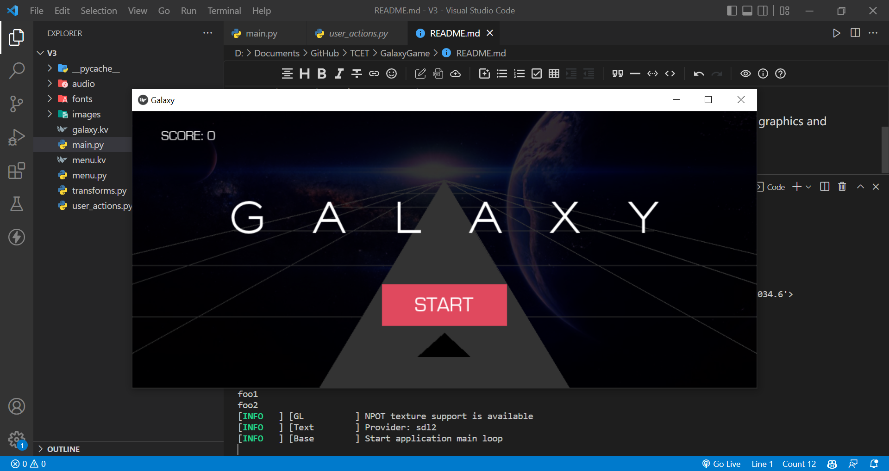
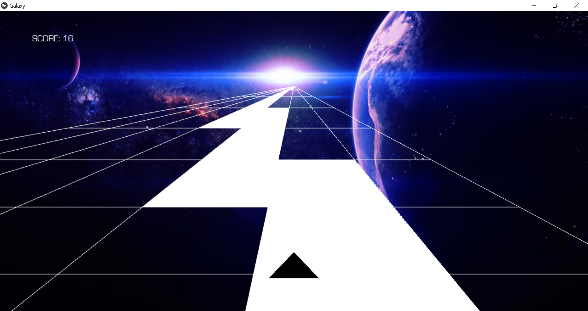
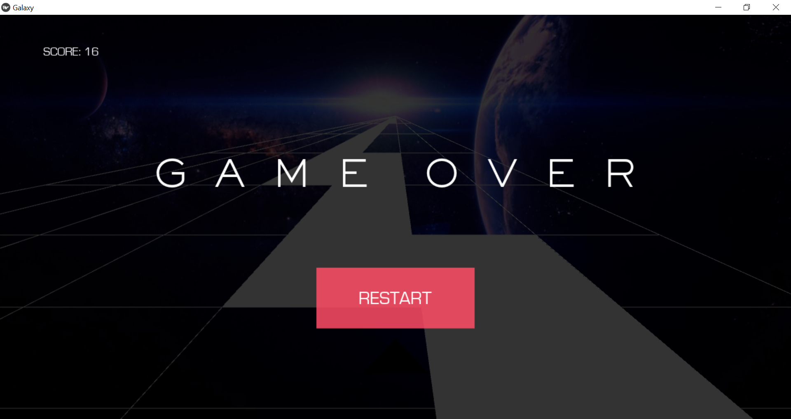

# GalaxyGame with Python & Kivy

Kivy is the most widely used Python module for game development as well as it gives us a better understanding of OOPs in Python.

Hence in this project, we use Kivy Module to build a GalaxyGame. Added sounds, background graphics and many more features.

